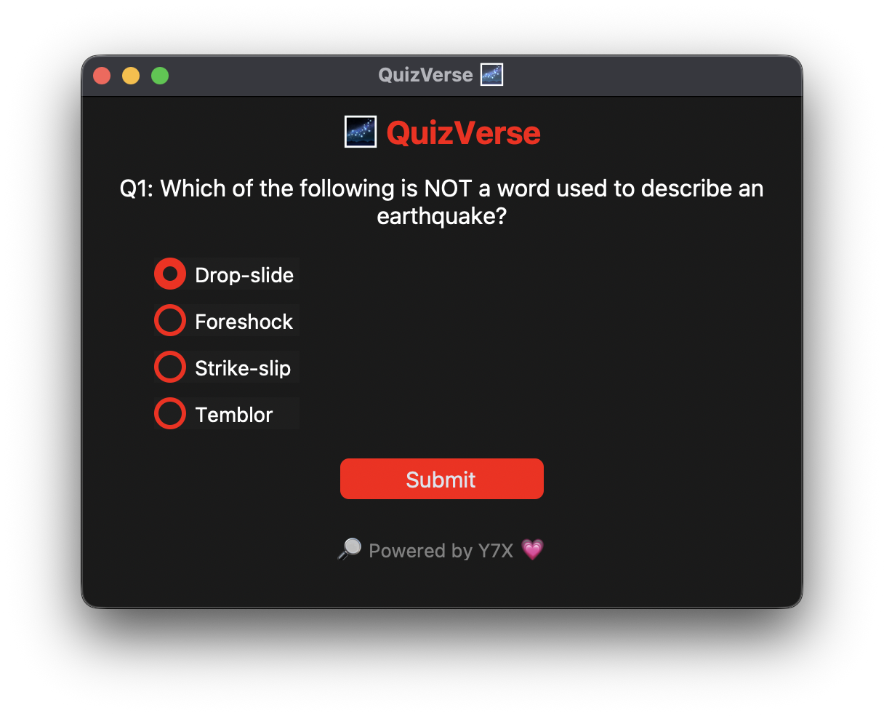

<div align="center">

# 🧠 QuizVerse
**⚙️ UI logic sharp as ever – QuizVerse tweaked**

A slick and sharp multiple-choice quiz app built with Python + CustomTkinter
Branded with 💗 by [Y7X-bit](https://github.com/Y7X-bit)



</div>

---

## 🌟 Features at a Glance

- 🌑 **Dark Mode UI** — Smooth, visually chill interface
- 🔴 **Red-hot Design** — Buttons, outlines with pitch red energy
- ❓ **Randomized MCQs** — Pulled live from Open Trivia API
- ✅ **Live Score Tracking** — Know what you nailed instantly
- 🔄 **Instant Transitions** — No lag between questions
- 🧪 **Minimal Logic, Max Performance** — Clean Python scripting


---

## 🖥️ Installation

> Python 3.9 or later required

```bash
git clone https://github.com/Y7X-bit/QuizVerse.git
cd QuizVerse
pip install -r requirements.txt
python QuizVerse.py